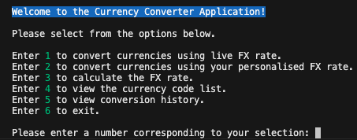
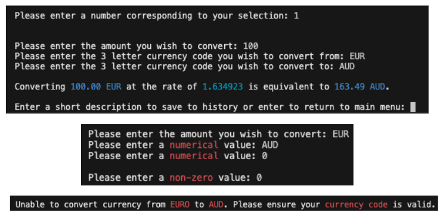
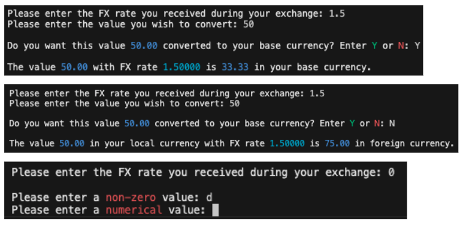
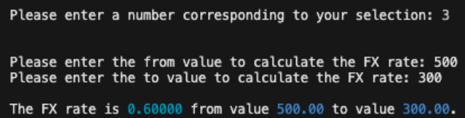
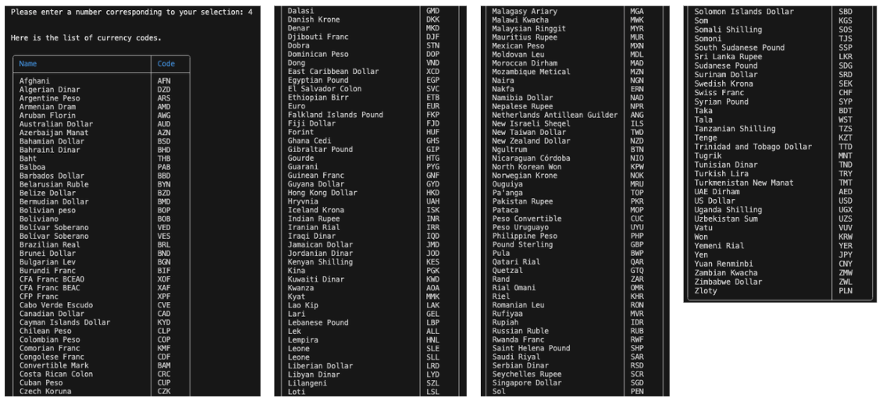
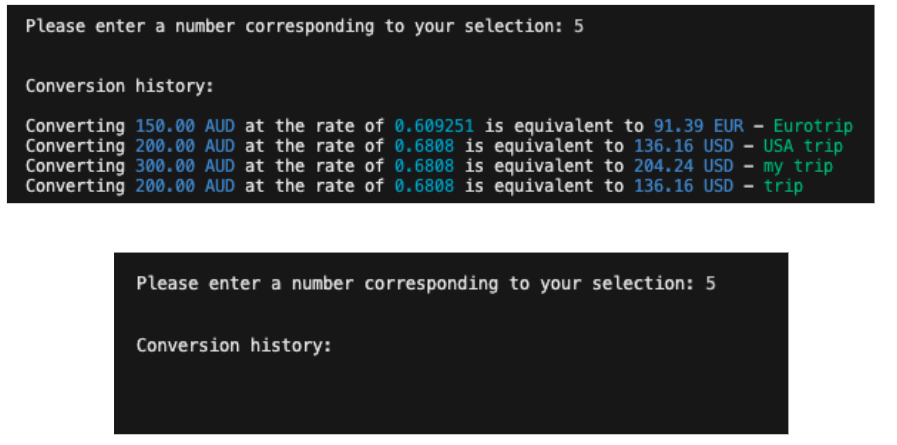
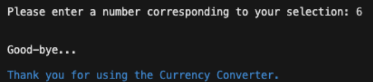

# Currency Converter Terminal CLI Application

## Table Of Contents

1. [Overview and Purpose](#overview-and-purpose)
2. [Features and Functions](#features-and-functions)
3. [User Stories](#user-stories)
4. [Set Up](#set-up)
5. [Application Help](<#application help>)
6. [References](#references)

---

## Overview and Purpose

This terminal command-line interface (CLI) application is a Currency Converter that helps users to convert the currency or currencies of their choice.
This is an ideal application for users travelling overseas or sending money overseas as this app allows the user to convert the value of money using the live exchange rate or the actual FX (Foreign Exchange) rate they received when they exchanged money (as often the received rate is generally lower than the live rate due to fees and commissions).  

---

## Features and Functions

- Convert currencies using the live FX rate.
    - The app will take the user's selections of base currency to convert to selected foriegn currency using the live FX rate.
- Convert currencies using an actual FX rate.
    - The user can input an FX rate and a value amount and the app will output the converted amount either to base currency or foreign currency based on the user's selection - this way the user can track how much they are spending in base currency
    (eg. when the user goes overseas and exchanges money, the rate may be worse than the market rate).
    - Similarly this function can be used when sending money overseas
    (eg. you want to send the value of 100 in foreign currency but don't know how much that is in your base currency). 
- Calculate the actual FX rate.
    - The user can input the base currency value and the foreign currency value and the app will calculate the FX rate.  
- Save live FX rate conversions to a file.
    - The user can choose to save the conversion for their own record.
- View conversion history.
    - The user can view their saved conversions.

---

## User Stories

- As a user, I want to be able to convert currencies using the live exchange rate.  
    - For example, if I plan to travel to the US I want to know how much my AUD is currently worth base on the live exchange rate.
- As a user, I want an app that can convert my selected currency using my provided FX rate.
    - For example, when I am overseas and have already converted my currencies at a counter or from an ATM. Before buying a product like a 30 Euro T-shirt, I want to use the exchange rate I recevied to convert back to my base currency so I know how much the 30 Euro T-shirt is worth in AUD. 
- As a user, I want an app that can calculate the FX rate using the base and foriegn currency.
    - For example, I want to make an online purchase for an item at 10 USD but I'm only prepared to spend maximum 15 AUD. I would put these values into the app to calculate the FX rate so I can keep my eye out for when the rate is close to my limit to make the purchase.
- As a user, want to be able to save and review my conversions for my record and delete when I want
    - For example, when I'm at the exchange counter I want to review my conversions and compare the rates. This will make it easier when I'm excahnging multiple currencies at the same time.

---

## System Requirements

- Operating System: 
    - macOS, Windows or Linux
- RAM:
    - minimum 1-2 GB
- Storage:
    - minimum 2-4 GB free space
- CPU:
    - 1 GHz single core processor or 2 GHz dual-core processer or better (recommended)
- Python
    - version 3.7 or higher 

---

## Set Up

This application is run in terminal CLI and requires the latest python3 version installed.  
Please use the links under installation for steps to install.

---

### Installation

1. Please ensure to downlod the latest [Python3](https://realpython.com/installing-python/)
2. Install [Terminal for Windows](https://medium.com/@bonguides25/how-to-install-and-update-windows-terminal-in-windows-10-11-b85361b1aa07#:~:text=The%20first%20and%20easiest%20way,minutes%20to%20download%20and%20install.), or [Terminal for Mac](https://medium.com/@latusikl/the-ultimate-setup-for-macos-terminal-7fd340f58366)
3. Optional download: [Visual Studio Code](https://code.visualstudio.com/docs/setup/setup-overview) is another terminal that can be used to run the applciation
4. Clone from repository to local machine with the following command in terminal:
```bash
git clone https://github.com/TilleyCodes/Documention_Presentation_Assignment
```
5. **Virtual Environment Set Up:** Dependant packages are installed through the terminal virtual environment for dependancy isolation and system python protection.  
    Follow these steps in terminal **before** installing the dependant packages:  
    i. enter virtual environment 
```bash
python -m venv env
```  
- once the the program has run you will see a folder name .venv
    iia. activate environment for macOS/Linux 
```bash
source .venv/bin/activate
```  
    iib. activate environment for windows input:
 ```bash
  .\env\Scripts\activate
  ```
- this will activate virtual environment. You can then run the pip install command for the corresponding packages per below.   
    iii. deactivate virtual environment
```bash
deactivate
```  
- this will exit out of the virtual environment 
6. Install the depandent packages as listed in requirements.txt with the below command, or you may install separately with the commands under dependencies and licenses
```bash
pip install -r requirements.txt
``` 

---

### Dependencies and Licenses

The application is dependant on the following packages. Once you have entered into virtual environment (steps provided under Installation), run the pip install command per below to install the packages. 
List of required packages are under requirements.txt file.  

- colored==2.2.4 - This package provides a library of 256 colours for formatting coloured text within Python projects
    - license: MIT License
    - copyright 2014 - 2023 Dimitris Zlatanidis
- for installation:
```bash
    pip install colored
```
- to import with Python:
```bash
from colored import Fore, Back, Style
```
- currency-codes==23.6.4 - This package is a comprehensive package for managing currency codes across different types of assets, simplifying the development process for applications involving multiple types of currencies. For the purpose of this application only the fiat currency codes are used.
    - license: GNU General Public License v3.0
    - copywrite 2007 free sottware foundation
```bash
pip install currency-codes
```
- tabulate==0.9.0 - This relatively simple package formats data and and outputs it within small tables in a readable presentation of both text and numerical data.
    - license: MIT License (MIT)
    - copywrite 2011 - 2020 Sergey Astanin
```bash
pip install tabulate
```
- pytest==8.3.3 - This package creates a framework allowing the user to test small sequences of code using the "assert" statement.
    - license: MIT License (MIT)
    - copywrite 2004 Holger krekel and others
```bash
pip install pytest
```
- python-dotenv==1.0.1 - This package allows users to store key-value pairs from a ".env" file and sets them as environmental variables, allowing the storage of sensitive data that can be excluded from deployment to the public.
    - license: BSD License (BSD-3-Clause)
    - copywrite 2014 Saurabh Kumar (python-dotenv), 2013 Ted Tieken (django-dotenv-rw), 2013 Jacob Kaplan-Moss (django-dotenv)
```bash
pip install python-dotenv
```
- http://api.exchangeratesapi.io/v1/convert - license: Master Software as a Service Subscription Agreement (SaaS) 
    - the API key is used to extract live FX rates
    - the exchangerates API Key code is stored in .env for privacy protection and ignored in gitignore however the .env.sample will list what is required

---

### Ethical Impact of the Licenses

#### MIT License 

The MIT license is a simple and permissive software license widely used by developers for its brevity and use, modification and distribution with very limited legal barriers for both commercial and personal use. As one of the most simplistic and permissive licenses used, the MIT License includes some significant ethical risks when releasing code for use by others, being its lack of warranty and liability, meaning users are able to use your code for whatever purposes or projects they choose to, with little to no constraints or limitations on your end and no legal repercussions if used in unethical practices.

#### GNU General Public License v3.0

The GNU General Public License v3.0 is a popular software license that lives within a group named the GNU General Public Licenses, that ensures users the freedom to use, share, and modify all software using their license. Being a widely used and ensuring the freedom of use under its licensing it shares similar ethical risks as the MIT License does, being that all code released under the General Public License are able to be used by any other users for any purposes or projects.

#### BSD License (BSD-3-Clause)

The BSD License is another popular open source software license offering developers a flexible and permissive framework for software distribution with minimal restrictions and limitations on how software can be used, modified or redistributed. With the freedom that comes from minimal constraints it also shares the same ethical risks as other popular free software licenses, with very limited actions that can be taken if users decide to use your source code for unethical practices.

#### api.exchangeratesapi.io

Please visit this link for [Master Software as a Service Subscription Agreement (SaaS)](https://exchangeratesapi.io/agreement/)

---

## Application Help

Open the terminal and run the application.  
(Ensure the set-up and installation steps have been completed).  

- Check python version by inputing in command line.  
```bash
python --version
``` 
or 
```bash
python3 --version
```  
- To run the application, depending on your system and set-up, you may use <u>python</u> or <u>python3</u> and the file name. In this case main.py  
```bash
python main.py
``` 
or 
```bash
python3 main.py
```  

You will see a welcome message and a list of selections below.

Simply enter the number corresponding to your selection.  



- ```Enter 1 to convert currencies using live FX rate.```
    - ```Please enter the amount you wish to convert:``` *This needs to be a numerical value.*
    - ```Please enter the currency code you wish to convert from:``` *The currency code is a 3 letter code representing the currency of choice, you are allowed 3 attempts to enter the correct currency code (if unsure you can view the currency code by entering 4 in the main menu).*
    - ```Please enter the currency code you wish to convert to:``` *The currency code is a 3 letter code representing the currency of choice you are allowed 3 attempts to enter the correct currency code (if unsure you can view the currency code by entering 4 in the main menu).*
    - ```Enter a short description to save a history or enter to exit:``` *If you want to save a history of this conversion, enter a short description otherwise enter with no description will not save.*


    
- ```Enter 2 to convert currencies using your personalised FX rate.```
    - ```Please enter the FX rate you received during your exchange:``` *This is the FX rate given when you the the exchange. You are allowed 3 attempts to enter the a numerical value and cannot be zero*
    - ```Please enter the value you wish to convert:``` *This is the monetary value. You are allowed 3 attempts to enter the a numerical value and cannot be zero*
    - ```Do you want this value "x" converted to your base currency? Enter Y or N:``` *to assist with the calculation, enter Y if this is to be converted back to your base currency, (if the value you had input in the above line is the foreign value) otherwise enter N.*



- ```Enter 3 to calculate the FX rate.```
    - ```Please enter the from value to calculate the FX rate:``` *This is the base monetary value. You are allowed 3 attempts to enter the a numerical value and cannot be zero*
    - ```Please enter the to value to calculate the FX rate:``` *This is the foreign monetary value. You are allowed 3 attempts to enter the a numerical value and cannot be zero*



- ```Enter 4 to view the currency code list.```
    - *By entering 4, the Currency Code table will automatically populate.*



- ```Enter 5 to view conversion history.```
    - *By entering 5, the conversion history list will appear if available.*



- ```Enter 6 to exit.```
    - *By entering 6, you will exit the application and a farewell message will appear.*



---

## References

- Astanin, S. (2022). tabulate: Pretty-print tabular data. [online] PyPI. Available at: https://pypi.org/project/tabulate/.

- bonguides.com (2024). How to Install and Update Windows Terminal in Windows 10/11. [online] Medium. Available at: https://medium.com/@bonguides25/how-to-install-and-update-windows-terminal-in-windows-10-11-b85361b1aa07#:~:text=The%20first%20and%20easiest%20way [Accessed 23 Sep. 2024].

- code.visualstudio.com. (2024). Setting up Visual Studio Code. [online] Available at: https://code.visualstudio.com/docs/setup/setup-overview.

- docs.pytest.org. (n.d.). How to monkeypatch/mock modules and environments - pytest documentation. [online] Available at: https://docs.pytest.org/en/stable/how-to/monkeypatch.html.

- docs.python.org. (n.d.). 9. Classes — Python 3.8.4rc1 documentation. [online] Available at: https://docs.python.org/3/tutorial/classes.html.

- dslackw (2023). colored: Simple library for color and formatting to terminal. [online] PyPI. Available at: https://pypi.org/project/colored/.

- Holger, H., Oliveira, B., Pfannschmidt, R., Bruynooghe, F., Laugher, B. and Bruhin, F. (2024). pytest: pytest: simple powerful testing with Python. [online] PyPI. Available at: https://pypi.org/project/pytest/.

- krekel, holger and Team, P. (n.d.). How to monkeypatch/mock modules and environments - pytest documentation. [online] docs.pytest.org. Available at: https://docs.pytest.org/en/stable/how-to/monkeypatch.html.

- Kuchumov, A. (2023). currency-codes. [online] PyPI. Available at: https://pypi.org/project/currency-codes/ [Accessed 23 Sep. 2024].

- Kumar, S. (2024). python-dotenv: Add .env support to your django/flask apps in development and deployments. [online] PyPI. Available at: https://pypi.org/project/python-dotenv/.

- Łukasz Latusik (2023). The Ultimate Setup for macOS Terminal | Medium. [online] Medium. Available at: https://medium.com/@latusikl/the-ultimate-setup-for-macos-terminal-7fd340f58366 [Accessed 23 Sep. 2024].

- Mozilla (2023). HTTP Response Status Codes. [online] MDN Web Docs. Available at: https://developer.mozilla.org/en-US/docs/Web/HTTP/Status.

- python.org (2020). 8. Errors and Exceptions — Python 3.8.1 documentation. [online] Python.org. Available at: https://docs.python.org/3/tutorial/errors.html.

- Stack Overflow. (2024a). Module not found running on command line. [online] Available at: https://stackoverflow.com/questions/55102788/module-not-found-running-on-command-line [Accessed 24 Sep. 2024].

- Stack Overflow. (2024b). python exception message capturing. [online] Available at: https://stackoverflow.com/questions/4690600/python-exception-message-capturing [Accessed 24 Sep. 2024].

- TrickSumo (2023). Setting Up OpenAI API Key in Visual Studio Using Python and Dotenv. [online] YouTube. Available at: https://www.youtube.com/watch?v=x5rscbij8SA [Accessed 25 Sep. 2024].

‌


